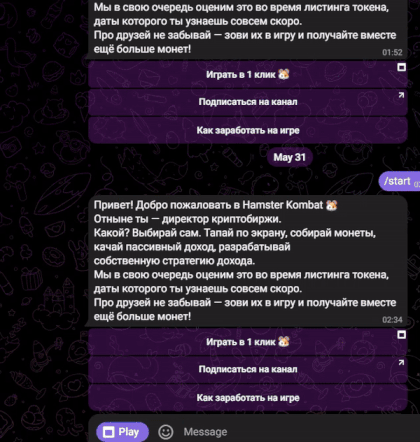

> [!NOTE]
> - Contacts: [Telegram](https://t.me/a_homous)
> - Channel: [Telegram Channel](https://t.me/homous_airdrops)
> - توضیحات به زبان فارسی [اینجا](README-FA.md)
---
## How to run
- Install extension in your browser [Violentmonkey](https://chromewebstore.google.com/detail/violentmonkey/jinjaccalgkegednnccohejagnlnfdag?hl=be)
- In order for **Hamster Kombat** to open in a browser, install [this script](https://github.com/amir-homous/Hamster-Kombat/raw/main/hamster-kombat.user.js)
- To install **autoclicker** install [this script](https://github.com/amir-homous/Hamster-Kombat/raw/main/hamster-autoclicker.user.js)
- Open [Bot Hamster Kombat](https://web.telegram.org/k/#?tgaddr=tg%3A%2F%2Fresolve%3Fdomain%3Dhamster_kombat_bot%26appname%3Dstart%26startapp%3DkentId2475526) and run the game

## 
---
> [!TIP]
> Other repositories:
> 
> - [Hamster Kombat + Autoclicker](https://github.com/amir-homous/Hamster-Kombat)
> 
> - [TapSwap + Autoclicker](https://github.com/amir-homous/TapSwap)
> 
> - [Blum + Autoclicker](https://github.com/amir-homous/Blum)
>
> - [PixelTap + Autoclicker](https://github.com/amir-homous/PixelTap)
> 
> - [MemeFi + Autoclicker](https://github.com/amir-homous/MemeFi-Coin)
>
> - [Yescoin + Autoclicker](https://github.com/amir-homous/Yescoin)
>
> - [Gemz + Autoclicker](https://github.com/amir-homous/Gemz)
>
> - [Сrossfi + Autoclicker](https://github.com/amir-homous/Crossfi)
>
> - [BUMP](https://github.com/amir-homous/BUMP)
>
> - [W-Coin](https://github.com/amir-homous/W-Coin)
---
> [!IMPORTANT] 
> Donation
> 
> We accept the following cryptocurrencies:
> 
> - **TON**: 
> 
> - **USDT**(TRC20): 
> 
> - **USDT**(TON): 
> 
> - **NOTCOIN**(TON): 
> 
> - **BTC**: 
> 
> Donations will be used to maintain the project.
